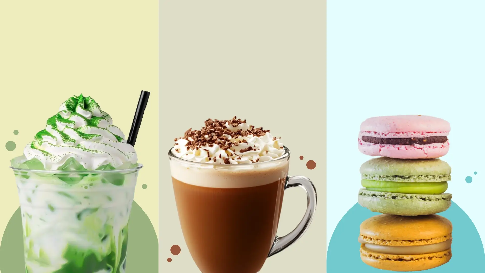

# ☕ Aura Café & Bites

Una landing page moderna desarrollada con **React** y **Vite**, inspirada en una cafetería especializada en bebidas artesanales, café de especialidad y bocados dulces. El proyecto busca ofrecer una experiencia visual agradable mediante una interfaz limpia, diseño responsive y una navegación intuitiva.

---

## ✨ Características

* 🎨 Diseño moderno y minimalista.
* 📱 Interfaz completamente responsive.
* ☕ Catálogo de bebidas y productos organizado por categorías.
* 🌿 Sección destacando ingredientes naturales y preparación artesanal.
* 💚 Alternativas vegetales para diferentes preferencias.
* 📍 Navegación por secciones: Menú, Locales y Contacto.
* 📸 Sección para interacción con la comunidad mediante redes sociales.

---

## 🛠️ Tecnologías utilizadas

* React
* Vite
* JavaScript (ES6+)
* Tailwind CSS
* HTML5
* CSS3

---

## 📂 Estructura del proyecto

```text
Aura/
├── public/
├── src/
├── .gitignore
├── index.html
├── package.json
├── vite.config.js
└── README.md
```

---

## 🚀 Instalación y ejecución

Clona el repositorio:

```bash
git clone https://github.com/TU_USUARIO/Aura.git
```

Accede al directorio del proyecto:

```bash
cd Aura
```

Instala las dependencias:

```bash
npm install
```

Inicia el servidor de desarrollo:

```bash
npm run dev
```

Genera la versión de producción:

```bash
npm run build
```

Previsualiza la versión de producción:

```bash
npm run preview
```

---

## 🌐 Demo

Puedes ver el proyecto desplegado en Vercel aquí:

**🔗 https://auracafe.vercel.app**

---

## 📸 Aura Cafe




---

## 🎯 Objetivo

Este proyecto fue desarrollado como práctica de desarrollo Frontend utilizando React, con el objetivo de fortalecer conocimientos en:

* Componentización.
* Diseño responsive.
* Maquetación moderna.
* Organización de proyectos con Vite.
* Estilizado mediante Tailwind CSS.

---

## 📄 Licencia

Este proyecto fue desarrollado como parte de un portafolio personal.
